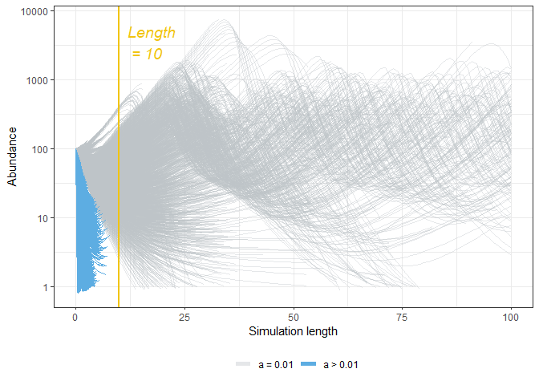
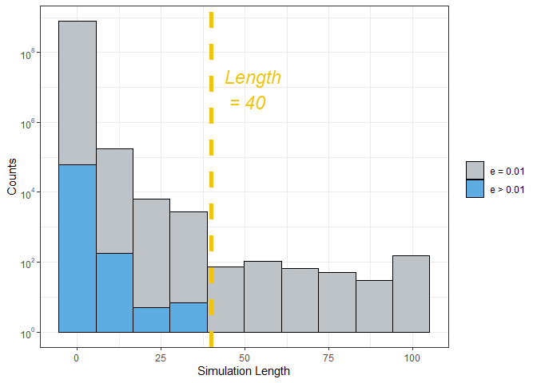
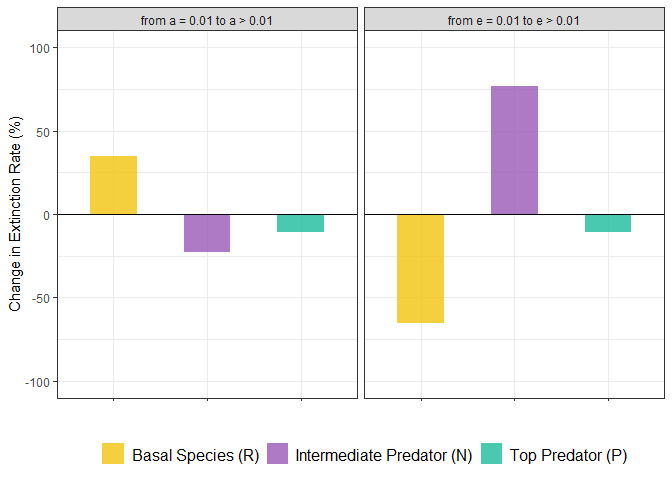
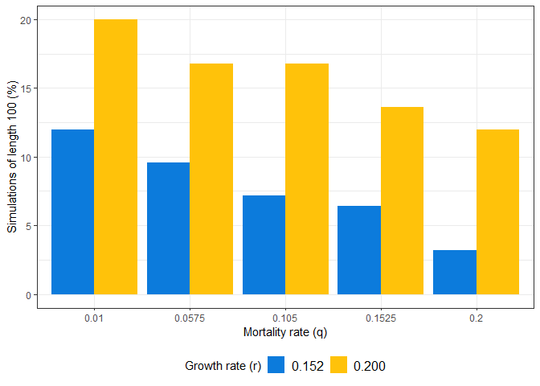
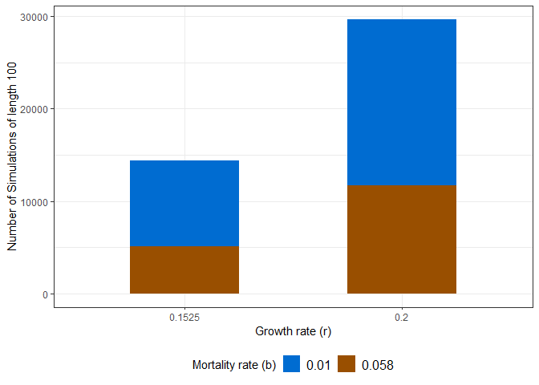
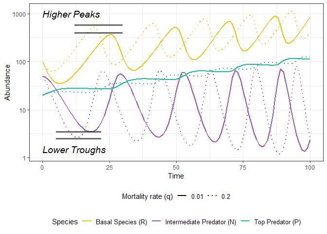
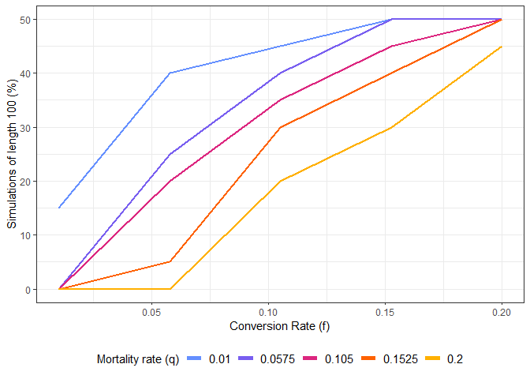
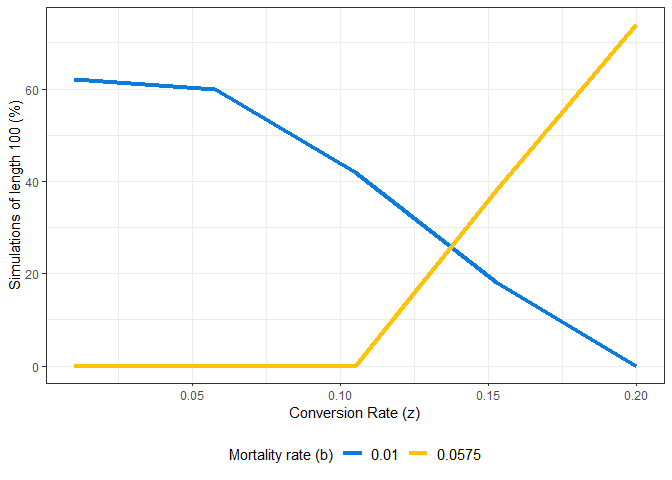
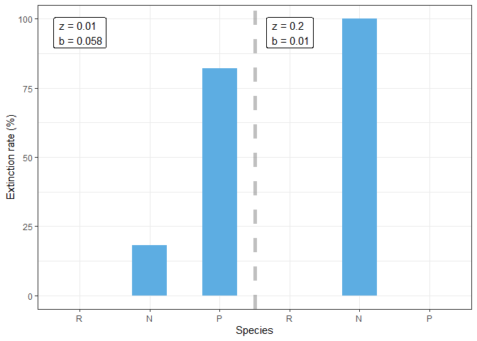
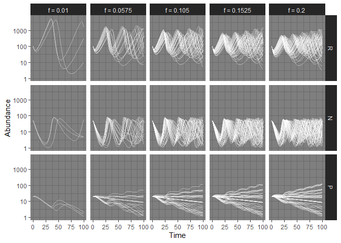

Three-Species Lotka-Volterra Model
================

# Model

``` r
library(deSolve)    ## Import deSolve for solving differential equation 
library(tidyverse)  ## Import tidyverse for data manipulation and plotting
```

``` r
## This function defines the three-species Lotka-Volterra model

lv3 <- function(t, start, parms){
  ## Set the start value for each species
  
  R <- start["R"]   ## Basal/prey species
  
  N <- start["N"]   ## Intermediate predators
  
  P <- start["P"]   ## Top predators
  
  ## Allow R to look within ``parms`` for the values of parameters for calculation
  with(as.list(parms), {
    
    ## The differential equations
    
    dR <- r*R - a*N*R            ## 1. dynamics of basal/prey species
    
    dN <- f*a*N*R - q*N - e*N*P  ## 2. dynamics of intermediate predators
    
    dP <- z*e*N*P - b*P          ## 3. dynamics of top predators
    
    ## Return the abundances of each species as a list as required by lsoda
    ## deSolve will then group these into a data frame
    list(c(dR, dN, dP))
  })
}
```

``` r
## We will implement event and root functions for the 
## ordinary differential equations (ODE) solver.
## If the simulated abundance falls below 0, we will 
## set it to 0, i.e. extinction of the species

## Event function sets all values in vector y to 0
eventFun <- function(t, y, p){
  y <- c(0, 0, 0)
  return (y)
}

## Roots occur when a root function becomes zero
## So we set y to be a zero vector when one of its values
## falls below 0 to trigger the event function
rootFun <- function(t, y, p){
  if(min(y) < 1){
    y <- c(0, 0, 0)    ## If any values in y in less than 1, set all values to 0
  }
  return (y)
}
```

``` r
## We will then put the above function into a wrapper function which includes
##the ODE solver function and some data reshaping and saving out parameter combinations:

lv3_sim <- function(start, parms, time){
  ## Run the simulation with lsoda
  sim <- as_tibble(lsoda(y = start, 
                         times = time, 
                         func = lv3, 
                         parms = parms,
                         ## Pass the event function
                         events = list(func = eventFun,
                                       ## Event is triggered by 
                                       ## root function
                                       root = TRUE,
                                       ## Stop simulation if 
                                       ## event is triggered
                                       terminalroot = 1),
                         ## The root function to use
                         rootfunc = rootFun))
  
  ## Reshape the data into long format
  longer_sim <- sim %>% pivot_longer(-time, 
                                     values_to = "abundance", 
                                     names_to = "species")
  
  ## Add column for the number of years the time series ran for:
  longer_sim$sim_length<-max(longer_sim$time)
  
  ## Add column for parameters used to generate the simulation results, 
  ## also allow us to split the tibble up easily later
  longer_sim$parms <- paste(names(parms), parms, sep="=", collapse = ",")
  
  ## Make a list of the simulation results,
  ## and the parameters used to make them
  res <- list("sim" = longer_sim,
              "parameters" = parms)
  return(res)
}
```

``` r
## Define the parameters, starting population of species and time steps of simulation

parms = c(r = 0.3,   ## Growth rate of basal/prey species
          a = 0.008, ## Feeding rate of intermediate predators on basal species
          f = 0.02,  ## Conversion efficiency for intermediate predators
          q = 0.05,  ## Mortality rate of intermediate predators
          e = 0.01,  ## Feeding rate of top predators on intermediate predators
          z = 0.15,  ## Conversion efficiency for top predators
          b = 0.06)  ## Mortality rate of top predators

## Define the starting values of the simulation, 
## i.e. how many of each species are there to begin with
start <- c(R = 100, N = 50, P = 20)

## Set the length of the simulation (100 time steps)
## and the resolution (step size of 1 time step in this case)
time <- seq(0, 100, by = 1)

## Run the simulation
dd <- lv3_sim(start, parms, time)
```

``` r
## Here we plot the results obtained from the above

ggplot(dd$sim, aes(x=time, y=abundance, col=species)) + 
  
  ## Highlight time lag between peaks of different species
  annotate("rect",                             ## Draw rectangle
           xmin = c(21, 24),                   ## Specify start and end
           xmax = c(24, 31),                   ## of x and y for rectangle
           ymin = c(0, 0), 
           ymax = c(10000, 10000), 
           alpha = 0.3,                        ## Specify opacity
           fill = c("#E1BE6A", "#40B0A6")) +   ## and colour of fill
  
  ## Highlight time lag between troughs of different species
  annotate("rect",                             ## Draw rectangle
           xmin = c(62.5, 76),                 ## Specify start and end
           xmax = c(76, 85),                   ## of x and y for rectangle
           ymin = c(0, 0), 
           ymax = c(10000, 10000), 
           alpha = 0.3,                        ## Specify opacity
           fill = c("#E1BE6A", "#40B0A6")) +   ## and colour of fill
  geom_line(size = 1.2) +                      ## Plot the abundance against time 
  scale_y_continuous(trans = "log10") +        ## Log transform y-axis to handle large values
  theme_bw() +                                 ## Use black-and-white theme
  theme(legend.position = "bottom",            ## Put legend at bottom
        legend.title = element_blank(),        ## Hide legend title
        legend.text=element_text(size = 12)) + ## Set legend text size
  scale_color_manual(values = c("#F1C40F",     ## Specify colour scheme
                               "#9B59B6", 
                               "#1ABC9C"),
                     breaks = c("R",           ## and which colour for which species
                                "N", 
                                "P"),
                     labels = c("Basal Species (R)",          ## Set legend text for each colour
                               "Intermediate Predator (N)", 
                               "Top Predator (P)")) + 
  annotate("text", x = 40, y = 2000, label = "Peaks",         ## Add text annotation for peaks ...
           fontface = "italic", hjust = 1, size = 6) +
  annotate("segment", x = 35, xend = 22, y = 2500,            ## ... and 3 lines pointing to 
           yend = 4900, lwd = 1, alpha = 0.5) +               ## one of the peaks for each species
  annotate("segment", x = 32, xend = 24, y = 1400, 
           yend = 150, lwd = 1, alpha = 0.5) +
  annotate("segment", x = 37, xend = 31, y = 1400, 
           yend = 22, lwd = 1, alpha = 0.5) +
  annotate("text", x = 88, y = 200, label = "Troughs",        ## Add text annotation for troughs ...
           fontface = "italic", hjust = 1, size = 6) +
  annotate("segment", x = 78, xend = 64.5, y = 128,           ## ... and 3 lines pointing to
           yend = 70, lwd = 1, alpha = 0.5) +                 ## one of the troughs for each species
  annotate("segment", x = 79, xend = 76, y = 127, 
           yend = 7, lwd = 1, alpha = 0.5) +
  annotate("segment", x = 80, xend = 84, y = 130, 
           yend = 9, lwd = 1, alpha = 0.5) +
  labs(x = "Time", y = "Abundance") +                         ## Set axis labels
  guides(colour = guide_legend(override.aes = list(size=2)))  ## Increase size of legend labels
```

<!-- -->

Predator-prey relationship is characterized by periodic, out-of-phase
cycles. As predators reduce the number of prey, lack of food eventually
diminishes predator abundance. Relief in predation allows the prey to
repopulate.

# Simulation

``` r
## Make a list of 5 equally spaced sequence from 0.01 to 0.20
## The list is replicated for each parameter in ``parms``
parms_list <- rep(list(seq(0.01, 0.20, length.out = 5)), length(parms))

## ``expand.grid()`` computes every possible combination 
## of the 5 values for all 7 parameters
all_var <- expand.grid(parms_list)
                       
##convert that into a list, where each object is 1 row of the data frame
all_var_list <- as.list(as.data.frame(t(all_var)))

## Look at the parameter values 
head(all_var)
```

    ##     Var1   Var2 Var3 Var4 Var5 Var6 Var7
    ## 1 0.0100 0.0100 0.01 0.01 0.01 0.01 0.01
    ## 2 0.0575 0.0100 0.01 0.01 0.01 0.01 0.01
    ## 3 0.1050 0.0100 0.01 0.01 0.01 0.01 0.01
    ## 4 0.1525 0.0100 0.01 0.01 0.01 0.01 0.01
    ## 5 0.2000 0.0100 0.01 0.01 0.01 0.01 0.01
    ## 6 0.0100 0.0575 0.01 0.01 0.01 0.01 0.01

``` r
library(foreach)   ## Load foreach() for looping through the list of parameters
library(doSNOW)    ## Load foreach() parallel adapter for parallelisation
library(parallel)  ## Load detectCores()
```

``` r
## Simulation function to be applied 

simulate <- function(x, name_vars, start, time) {
  ## Change parameter names to match those in the equation
  names(x) <- name_vars
  
  ## Pass the arguments to the function and run the simulation
  dd <- lv3_sim(start = start, 
                parms = x, 
                time = time)
  
  ## Return the simulation results
  return(dd$sim)
}
```

``` r
## Make a progress bar and set the maximum to the length 
## of the list we are iterating across
pb <- txtProgressBar(max = length(all_var_list), style = 3)
```

    ##   |                                                                              |                                                                      |   0%

``` r
## Make a function to pass the progress bar to the clusters
progress <- function(n) setTxtProgressBar(pb, n)

## Set the option for snow to include a progress bar
opts <- list(progress = progress)
```

``` r
## Run the simulation in parallel by applying the 
## simulation function to each entry in the parameter list  

## Set the amount of clusters to run the code on 
## Number of clusters = number of cores - 1
clus <- makeCluster(detectCores() - 1)

## Register the SNOW parallel backend with the foreach package
registerDoSNOW(clus)

## Use foreach() to loop over the parameters in the list
## Use %dopar% for parallelisation
res <- foreach(i = all_var_list, 
               ## ``rbind`` returns data frame instead of list
               .combine = 'rbind',        
               ## Load the packages into the parallel environment
               .packages = c('tidyverse', 'deSolve'),  
               ## Load the options with .options.snow
               .options.snow = opts,
               ## If error, results for that task will not be returned or included 
               .errorhandling = "remove") %dopar%{
               ## Apply the simulation function
                   simulate(i, names(parms), start, time = time)  
                 }
```

    ##   |                                                                              |                                                                      |   1%  |                                                                              |=                                                                     |   1%  |                                                                              |=                                                                     |   2%  |                                                                              |==                                                                    |   2%  |                                                                              |==                                                                    |   3%  |                                                                              |==                                                                    |   4%  |                                                                              |===                                                                   |   4%  |                                                                              |===                                                                   |   5%  |                                                                              |====                                                                  |   5%  |                                                                              |====                                                                  |   6%  |                                                                              |=====                                                                 |   6%  |                                                                              |=====                                                                 |   7%  |                                                                              |=====                                                                 |   8%  |                                                                              |======                                                                |   8%  |                                                                              |======                                                                |   9%  |                                                                              |=======                                                               |   9%  |                                                                              |=======                                                               |  10%  |                                                                              |=======                                                               |  11%  |                                                                              |========                                                              |  11%  |                                                                              |========                                                              |  12%  |                                                                              |=========                                                             |  12%  |                                                                              |=========                                                             |  13%  |                                                                              |=========                                                             |  14%  |                                                                              |==========                                                            |  14%  |                                                                              |==========                                                            |  15%  |                                                                              |===========                                                           |  15%  |                                                                              |===========                                                           |  16%  |                                                                              |============                                                          |  16%  |                                                                              |============                                                          |  17%  |                                                                              |============                                                          |  18%  |                                                                              |=============                                                         |  18%  |                                                                              |=============                                                         |  19%  |                                                                              |==============                                                        |  19%  |                                                                              |==============                                                        |  20%  |                                                                              |==============                                                        |  21%  |                                                                              |===============                                                       |  21%  |                                                                              |===============                                                       |  22%  |                                                                              |================                                                      |  22%  |                                                                              |================                                                      |  23%  |                                                                              |================                                                      |  24%  |                                                                              |=================                                                     |  24%  |                                                                              |=================                                                     |  25%  |                                                                              |==================                                                    |  25%  |                                                                              |==================                                                    |  26%  |                                                                              |===================                                                   |  26%  |                                                                              |===================                                                   |  27%  |                                                                              |===================                                                   |  28%  |                                                                              |====================                                                  |  28%  |                                                                              |====================                                                  |  29%  |                                                                              |=====================                                                 |  29%  |                                                                              |=====================                                                 |  30%  |                                                                              |=====================                                                 |  31%  |                                                                              |======================                                                |  31%  |                                                                              |======================                                                |  32%  |                                                                              |=======================                                               |  32%  |                                                                              |=======================                                               |  33%  |                                                                              |=======================                                               |  34%  |                                                                              |========================                                              |  34%  |                                                                              |========================                                              |  35%  |                                                                              |=========================                                             |  35%  |                                                                              |=========================                                             |  36%  |                                                                              |==========================                                            |  36%  |                                                                              |==========================                                            |  37%  |                                                                              |==========================                                            |  38%  |                                                                              |===========================                                           |  38%  |                                                                              |===========================                                           |  39%  |                                                                              |============================                                          |  39%  |                                                                              |============================                                          |  40%  |                                                                              |============================                                          |  41%  |                                                                              |=============================                                         |  41%  |                                                                              |=============================                                         |  42%  |                                                                              |==============================                                        |  42%  |                                                                              |==============================                                        |  43%  |                                                                              |==============================                                        |  44%  |                                                                              |===============================                                       |  44%  |                                                                              |===============================                                       |  45%  |                                                                              |================================                                      |  45%  |                                                                              |================================                                      |  46%  |                                                                              |=================================                                     |  46%  |                                                                              |=================================                                     |  47%  |                                                                              |=================================                                     |  48%  |                                                                              |==================================                                    |  48%  |                                                                              |==================================                                    |  49%  |                                                                              |===================================                                   |  49%  |                                                                              |===================================                                   |  50%  |                                                                              |===================================                                   |  51%  |                                                                              |====================================                                  |  51%  |                                                                              |====================================                                  |  52%  |                                                                              |=====================================                                 |  52%  |                                                                              |=====================================                                 |  53%  |                                                                              |=====================================                                 |  54%  |                                                                              |======================================                                |  54%  |                                                                              |======================================                                |  55%  |                                                                              |=======================================                               |  55%  |                                                                              |=======================================                               |  56%  |                                                                              |========================================                              |  56%  |                                                                              |========================================                              |  57%  |                                                                              |========================================                              |  58%  |                                                                              |=========================================                             |  58%  |                                                                              |=========================================                             |  59%  |                                                                              |==========================================                            |  59%  |                                                                              |==========================================                            |  60%  |                                                                              |==========================================                            |  61%  |                                                                              |===========================================                           |  61%  |                                                                              |===========================================                           |  62%  |                                                                              |============================================                          |  62%  |                                                                              |============================================                          |  63%  |                                                                              |============================================                          |  64%  |                                                                              |=============================================                         |  64%  |                                                                              |=============================================                         |  65%  |                                                                              |==============================================                        |  65%  |                                                                              |==============================================                        |  66%  |                                                                              |===============================================                       |  66%  |                                                                              |===============================================                       |  67%  |                                                                              |===============================================                       |  68%  |                                                                              |================================================                      |  68%  |                                                                              |================================================                      |  69%  |                                                                              |=================================================                     |  69%  |                                                                              |=================================================                     |  70%  |                                                                              |=================================================                     |  71%  |                                                                              |==================================================                    |  71%  |                                                                              |==================================================                    |  72%  |                                                                              |===================================================                   |  72%  |                                                                              |===================================================                   |  73%  |                                                                              |===================================================                   |  74%  |                                                                              |====================================================                  |  74%  |                                                                              |====================================================                  |  75%  |                                                                              |=====================================================                 |  75%  |                                                                              |=====================================================                 |  76%  |                                                                              |======================================================                |  76%  |                                                                              |======================================================                |  77%  |                                                                              |======================================================                |  78%  |                                                                              |=======================================================               |  78%  |                                                                              |=======================================================               |  79%  |                                                                              |========================================================              |  79%  |                                                                              |========================================================              |  80%  |                                                                              |========================================================              |  81%  |                                                                              |=========================================================             |  81%  |                                                                              |=========================================================             |  82%  |                                                                              |==========================================================            |  82%  |                                                                              |==========================================================            |  83%  |                                                                              |==========================================================            |  84%  |                                                                              |===========================================================           |  84%  |                                                                              |===========================================================           |  85%  |                                                                              |============================================================          |  85%  |                                                                              |============================================================          |  86%  |                                                                              |=============================================================         |  86%  |                                                                              |=============================================================         |  87%  |                                                                              |=============================================================         |  88%  |                                                                              |==============================================================        |  88%  |                                                                              |==============================================================        |  89%  |                                                                              |===============================================================       |  89%  |                                                                              |===============================================================       |  90%  |                                                                              |===============================================================       |  91%  |                                                                              |================================================================      |  91%  |                                                                              |================================================================      |  92%  |                                                                              |=================================================================     |  92%  |                                                                              |=================================================================     |  93%  |                                                                              |=================================================================     |  94%  |                                                                              |==================================================================    |  94%  |                                                                              |==================================================================    |  95%  |                                                                              |===================================================================   |  95%  |                                                                              |===================================================================   |  96%  |                                                                              |====================================================================  |  96%  |                                                                              |====================================================================  |  97%  |                                                                              |====================================================================  |  98%  |                                                                              |===================================================================== |  98%  |                                                                              |===================================================================== |  99%  |                                                                              |======================================================================|  99%  |                                                                              |======================================================================| 100%

``` r
## Shut down the clusters for good practice
stopCluster(clus)
```

``` r
## Remove parameter labels in new column
res$parms2 <- gsub("[a-z]=", "", res$parms)

## Each parameter is put into its own column
res_by_parms <- res %>% 
  separate(parms2, into = names(parms), sep = ",") 

## Convert the parameters into numeric types
res_by_parms[, names(parms)] <- res_by_parms[, names(parms)] %>% sapply(., as.numeric)

## Change species to factors so that plots order them by trophic levels
res_by_parms$species <- factor(res_by_parms$species, levels = c("R", "N", "P"))

## Look at the top rows
head(res_by_parms)
```

    ## # A tibble: 6 x 12
    ##   time  species abundance sim_length parms     r     a     f     q     e     z
    ##   <deS> <fct>   <deSolve>      <dbl> <chr> <dbl> <dbl> <dbl> <dbl> <dbl> <dbl>
    ## 1 0     R       100.00000       20.6 r=0.~  0.01  0.01  0.01  0.01  0.01  0.01
    ## 2 0     N        50.00000       20.6 r=0.~  0.01  0.01  0.01  0.01  0.01  0.01
    ## 3 0     P        20.00000       20.6 r=0.~  0.01  0.01  0.01  0.01  0.01  0.01
    ## 4 1     R        64.21405       20.6 r=0.~  0.01  0.01  0.01  0.01  0.01  0.01
    ## 5 1     N        40.87718       20.6 r=0.~  0.01  0.01  0.01  0.01  0.01  0.01
    ## 6 1     P        19.89089       20.6 r=0.~  0.01  0.01  0.01  0.01  0.01  0.01
    ## # ... with 1 more variable: b <dbl>

# Analyses

## Attack Rate

``` r
## This code plots the abundance over time for one of the species 
## and compares the difference in simulation length for a = 0.01 and a > 0.01

res_by_parms %>%
  mutate(a_lowest = ifelse(a == 0.01,           ## Add column to differentiate by values of 'a'
                           "a = 0.01",          ## This facilitates grouping by ggplot
                           "a > 0.01")) %>%  
  ## Filter only one species since the simulation length 
  ## is the same for all three species each simulation
  filter(species == "R") %>%
  ggplot(aes(x = time,                          ## Plot abundance against time
             y = abundance, 
             group = interaction(parms),        ## One line for each parameter combination
             col = a_lowest,                    ## Set different colours and alphas
             alpha = a_lowest)) +               ## for the two categories of 'a'
  geom_line() +
  scale_y_log10() +                             ## Log transform the y-axis
  scale_colour_manual(values = c("#BDC3C7", 
                                 "#5DADE2")) +  ## Set colour scheme
  scale_alpha_manual(values = c(0.4, 1)) +      ## and alpha levels
  theme_bw() +
  theme(legend.position = "bottom",             ## Legend at bottom
        legend.title = element_blank()) +       ## and remove legend title
  geom_vline(xintercept = 10,                   ## Add reference line at x = 10
             color = "#F1C40F", size = 1) +
  annotate("text", x = 12, y = 3500, hjust = 0, ## Annotate the line with 'Length = 10'
           label = "Length \n = 10", fontface = "italic",
           col = "#F1C40F", size = 5) +
  labs(x = "Simulation length", y = "Abundance") +
  guides(colour = guide_legend(override.aes = list(size=2)))  ## Increase size of legend labels
```

<!-- -->

Attack rate describes a predator’s hunting efficiency, and has the
strongest effect on system longevity. For \(a\) \> 0.01 , none of the
simulations’ length passes 10, regardless of other parameters.
Conversely, for \(a\) = 0.01, many of the simulations reach time = 100.

``` r
## Here we plot the count of simulation length 
## for attack rate 'e' = 0.01 and 'e > 0.01' with a histogram

library(scales) ## for formatting tick labels

res_by_parms %>%
  filter(time == sim_length &                      ## To avoid overcounting, we one entry for each simulation
           species == "R") %>%                     ## and only for one species
  mutate(e_lowest = ifelse(e == 0.01,              ## Add column to differentiate by values of a
                           "e = 0.01",             ## This facilitates grouping by ggplot
                           "e > 0.01")) %>%
  ggplot(aes(x = sim_length,                       ## Plot the count of simulation lengths
             fill = e_lowest)) +                   ## Two fill colours for two categories of 'e' values
  scale_y_log10(breaks = trans_breaks("log10", function(x) 10^x),     ## Log transform y-axis
              labels = trans_format("log10", math_format(10^.x))) +   ## and format tick labels  
  geom_histogram(bins = 10,                        ## Add histogram 
                 color = "black") +
  labs(y = "Counts",                               ## Add axis labels 
       x = "Simulation Length") + 
  theme_bw() +                                     ## Use black-and-white theme
  theme(legend.title = element_blank()) +          ## Remove legend title
  scale_fill_manual(values = c("#BDC3C7",          ## Set colour scheme 
                               "#5DADE2")) +
  geom_vline(xintercept = 40, color = "#F1C40F",   ## Set reference line at x = 40
             size = 2, lty = "dashed") +
  annotate("text", x = 44, y = 9000000,             ## Annotate the line with 'Length = 40'        
           label = "Length \n = 40", fontface = "italic", 
           hjust = 0, size = 6, color = "#F1C40F")
```

<!-- -->

Similar pattern can be observed for \(e\).

``` r
## Here we calculate the changes in the extinction rate of all species 
## Extinction rate for a species is calculated as 
## (the number of simulations that results in extinction) / (total number of simulations)
###################################################
## We calculate extinction rate differences between
## 1. a = 0.01 and a > 0.01
## 2. e = 0.01 and e > 0.01

res_by_parms <- res_by_parms %>% 
  mutate(a_lowest = ifelse(a == 0.01, "a = 0.01", "a > 0.01"),  ## Add categorical variable columns
         e_lowest = ifelse(e == 0.01, "e = 0.01", "e > 0.01"))  ## for manipulation in the following

## Get the number of simulations with abundance dropping below 1 per group
abun_less_than_1_a <- res_by_parms %>%             
  filter(time == sim_length &             ## Get only last frame of simulation
           abundance < 1) %>%             ## Get only extinct species
  group_by(a_lowest, species) %>%         ## Group by 'a' category and species
  summarise("less_than_1" = n())          ## Return counts

## Get the total number of simulations per group
abun_total_a <- res_by_parms %>%          
  filter(time == sim_length) %>%          ## Get only last frame of simulation
  group_by(a_lowest, species) %>%         ## Group by 'a' category and species
  summarise(total = n())                  ## ## Return counts

## Join the two data frames together and compute the percentage difference
abun_perc_a <- left_join(abun_total_a, abun_less_than_1_a) %>%    ## Join the two data frames
  replace(is.na(.), 0) %>%                                        ## Replace NA with 0 for 0 counts
  mutate(perc = less_than_1/total * 100) %>%         ## Calculate percentage of extinction
  select(-total, -less_than_1) %>%                   ## Drop two columns for conversion to wide format
  pivot_wider(names_from = a_lowest, values_from = perc) %>%      ## Convert to wider format
  mutate(diff = (`a > 0.01` - `a = 0.01`)) %>%                    ## Compute % difference
  select(species, diff) %>%                                       ## Only select useful columns
  mutate(parm = "a")        ## Add classifier for parameter for joining with another data frame later

## Repeat the above but for parameter 'e'

#######

abun_less_than_1_e <- res_by_parms %>% 
  filter(time == sim_length & abundance < 1) %>%
  group_by(e_lowest, species) %>%
  summarise("less_than_1" = n())

abun_total_e <- res_by_parms %>% 
  filter(time == sim_length) %>%
  group_by(e_lowest, species) %>%
  summarise(total = n())

abun_perc_e <- left_join(abun_total_e, abun_less_than_1_e) %>%
  replace(is.na(.), 0) %>%
  mutate(perc = less_than_1/total * 100) %>%
  select(-total, -less_than_1) %>%
  pivot_wider(names_from = e_lowest, values_from = perc) %>%
  mutate(diff = (`e > 0.01` - `e = 0.01`)) %>%
  select(species, diff) %>%
  mutate(parm = "e")

#######

abun_diff <- rbind(abun_perc_a, abun_perc_e)    ## Combine the two data frames
abun_diff                                       ## View combined data frame
```

    ## # A tibble: 6 x 3
    ##   species  diff parm 
    ##   <fct>   <dbl> <chr>
    ## 1 R        34.7 a    
    ## 2 N       -22.8 a    
    ## 3 P       -11.0 a    
    ## 4 R       -65.3 e    
    ## 5 N        76.9 e    
    ## 6 P       -10.8 e

``` r
## Present the data graphically

abun_diff %>% 
  ggplot(aes(species, diff, fill = species)) +          ## Plot percentage difference per species
  geom_bar(stat = "identity",                           ## Add bar chart, set stat = "identity" to 
           width = 0.5,                                 ## manually specify y values
           alpha = 0.8) +
  facet_wrap(.~~ifelse(parm == "a",                     ## Facet by parameters 
                       "from a = 0.01 to a > 0.01",     ## and specify facet labels
                       "from e = 0.01 to e > 0.01")) +                             
  geom_hline(yintercept = 0) +                          ## Add reference line at y = 0
  scale_fill_manual(values = c("#F1C40F",               ## Select colour scheme for species
                               "#9B59B6", 
                               "#1ABC9C"),
                    labels = c("Basal Species (R)",     ## Set legend text for each colour
                               "Intermediate Predator (N)", 
                               "Top Predator (P)")) +
  theme_bw() +                                          ## Use black-and-white theme
  theme(legend.title = element_blank(),                 ## Remove legend title
        legend.position = "bottom",                     ## Move legend to bottom
        legend.text=element_text(size = 12),            ## Set legend text size
        axis.text.x=element_blank()) +                  ## Remove x-axis tick labels
  labs(x = "", y = "Change in Extinction Rate (%)") +   ## Set axis labels
  ylim(c(-100, 100))                                    ## Set y limit for graph
```

<!-- -->

Here we define the extinction rate as the percentage of times a species
become extinct and stops the simulation.

A species’ attack rate has the strongest effect on its immediate prey’s
survival, as the extinction rate of \(R\) and \(N\) becomes much higher
when \(a\) and \(e\) goes over 0.01, respectively.

``` r
## Since attack rate has such an extreme effect on system survival, in subsequent analyses we exclude data where attack rate is higher than 0.01.

res_by_parms <- res_by_parms %>% 
  filter(a == 0.01 & e == 0.01)
```

## Growth rate

``` r
## Put data into categories according to 'r' values

res_by_parms <- res_by_parms %>%
  mutate(r_low = ifelse(r < 0.15, "r < 0.15", "r > 0.15")) 
```

``` r
## Here we plot the distribution of the simulation length to get an overview of results

res_by_parms %>%
  filter(time == sim_length) %>%       ## Get last entry of each simulation
  ggplot(aes(as.factor(r),             ## Turn 'r' into factor so each it
             sim_length,               ## is treated as discrete variable when plotting
             fill = r_low)) +          ## Fill colour by categories set above
  geom_boxplot() +                     ## Add box plot
  scale_fill_manual(values = c("#BDC3C7",       ## Set colour scheme 
                               "#5DADE2")) +
  theme_bw() +                                  ## Use black-and-white theme
  theme(legend.title = element_blank()) +       ## Remove legend title
  labs(x = "Growth Rate (r)",                   ## Set axis labels
       y = "Simulation Length") +
  geom_hline(yintercept = 100, color = "#F1C40F",  ## Add reference line at y = 100
             size = 2, alpha = 0.5)
```

<!-- -->

Simulations’ length are shorter than 100 when \(r\) \< 0.15. Only growth
rate higher than 0.15 supports system survival.

The average simulation length improves when \(r\) increases beyond 0.15,
suggesting additional benefits.

``` r
## Here we quantify the improvement by comparing
## the proportion of simulations that survive to time = 100

## Calculate the total number of simulations for each value of 'r'
no_of_runs <- res_by_parms %>%     
  filter(time == sim_length) %>%                  ## Only get last frame per simulation
  group_by(r) %>%                                 ## per each value of 'r'
  summarise(total = n())                          ## Get counts


## Calculate the number of simulations of length 100 for each value of 'r'
no_of_runs_to_100 <- res_by_parms %>%
  filter(time == sim_length &                     ## Only get last frame per simulation
           sim_length == 100) %>%                 ## and reaching length 100
  group_by(r) %>%                                 ## per each value of 'r'
  summarise(to_100 = n())                         ## Get counts

## Join the two data frames together and calculate the proportions
runs_prop <- right_join(no_of_runs,               ## Join the two data frames, right_join
                        no_of_runs_to_100) %>%    ## to drop 0 counts when 'r' < 0.15
  mutate(prop = to_100/total)                     ## Calculate the proportions

## Display data frame
runs_prop
```

    ## # A tibble: 2 x 4
    ##       r total to_100   prop
    ##   <dbl> <int>  <int>  <dbl>
    ## 1 0.152  1875    144 0.0768
    ## 2 0.2    1875    297 0.158

``` r
0.1584/0.0768   ## Divide proportion values
```

    ## [1] 2.0625

The overall system survival rate improves by more than two-fold.

``` r
## Here we plot the combined abundance of all species to 
## look at the effect of 'r' on total species numbers

res_by_parms %>% 
  filter(sim_length == 100) %>%                   ## Get only complete simulations
  pivot_wider(names_from = "species",             ## Convert to wide format
              values_from = "abundance") %>%
  mutate(total = R + N + P) %>%                   ## Calculate total abundance for each entry
  ggplot(aes(time, total,                         ## Plot total abundance over time
             group = parms)) +                    ## Get one observation per set of parameters
  geom_line(alpha = 0.5, col = "grey40") +        ## Add line graph
  facet_wrap(.~ifelse(r < 0.2,                    ## Facet by 'r' values
                      "r = 0.153",                ## and specify facet label
                      "r = 0.2")) +
  theme_bw() +
  theme(legend.position = "none") + 
  labs(x = "Time", y = "Total Abundance")         ## Set axis labels
```

<!-- -->

The total abundance also increases, which can be attributed to the
system’s increased carrying capacity. Since growth rate controls the
size of basal population, a higher \(r\) provides more resources to
support the entire system.

``` r
## As before, we compare the changes in extinction rates between species
 

## Get the number of simulations with abundance dropping below 1 per group
abun_less_than_1_r <- res_by_parms %>% 
  filter(time == sim_length &          ## Get only last frame of simulation
           abundance < 1) %>%          ## Get only extinct species
  group_by(r_low, species) %>%         ## Group by 'r' category and species
  summarise("less_than_1" = n())       ## Get number of counts

## Get the total number of simulations per group
abun_total_r <- res_by_parms %>%       
  filter(time == sim_length) %>%       ## Get only last frame of simulation
  group_by(r_low, species) %>%         ## Group by 'r' category and species
  summarise(total = n())               ## Get number of counts

## Join the two data frames together and compute the percentage difference
abun_diff_r <- 
  left_join(abun_less_than_1_r, abun_total_r) %>%              ## Join the data frames
  mutate(prop = less_than_1/total*100) %>%           ## Calculate percentage of extinction
  select(-less_than_1, -total) %>%                   ## Drop two columns for conversion to wide format
  pivot_wider(names_from = "r_low", values_from = "prop") %>%  ## Convert to wide format
  mutate(diff = `r > 0.15` - `r < 0.15`)                       ## Compute percentage differences

## View data frame
abun_diff_r
```

    ## # A tibble: 3 x 4
    ##   species `r < 0.15` `r > 0.15`   diff
    ##   <fct>        <dbl>      <dbl>  <dbl>
    ## 1 R             2.08        0.8  -1.28
    ## 2 N            52.9        21.3 -31.6 
    ## 3 P            46.1        66.4  20.3

``` r
## Here we visualise the data obtained above

abun_diff_r %>% 
  ggplot(aes(species, diff, fill = species)) +           ## Plot percentage difference per species
  geom_bar(stat = "identity",                            ## Add bar chart, set stat = "identity" to
           width = 0.5,                                  ## manually specify y values
           alpha = 0.8) +    
  geom_hline(yintercept = 0) +                           ## Add reference line at y = 0
  scale_fill_manual(values = c("#F1C40F",                ## Specify colour scheme
                               "#9B59B6", 
                               "#1ABC9C"),
                    labels = c("Basal Species (R)",          ## Specify legend label texts
                               "Intermediate Predator (N)", 
                               "Top Predator (P)")) +
  theme_bw() +                                           ## Use black-and-white theme
  theme(legend.title = element_blank(),                  ## Remove legend title
        legend.position = "bottom",                      ## Move legend to bottom
        legend.text=element_text(size = 12),             ## Set legend text size
        axis.text.x=element_blank()) +                   ## Remove x-axis tick labels
  labs(x = "", y = "Change in Extinction Rate (%)") +    ## Set axis labels
  ylim(c(-35, 35)) +                                     ## Set y value limits
  annotate("label", x = 0.5, y = 30,                     ## Add annotation to indicate changes in parameters
           label = "from 'r < 0.15' \n to 'r > 0.15'",
           fontface = "italic", hjust = 0, size = 5)
```

<!-- -->

The species that experiences the highest reduction in extinction is
\(N\), which directly benefits from increased food supply.

## Mortality Rate

``` r
## We again exclude data with 'r' below 0.15 since simulations cannot reach time = 100 below that growth rate.

res_by_parms <- res_by_parms %>%
  filter(r > 0.15)
```

``` r
## Here we calculate the percentage of simulations that reach length 100 out of all simulations 
## across 5 values of 'q', at 2 different values of 'r'


## Subset the last frames of simulations and add a column
sim_comp <- res_by_parms %>%
  filter(sim_length == time) %>%        ## Filter last frame of each simulation
  mutate(complete = ifelse(sim_length == 100, 
                           "= 100", 
                           "< 100"))    ## set categorical variable to indicate if simulations reach length 100

## Compute the number of observations per each ...
q_by_r <- as.data.frame(table(sim_comp$q,         ## value of 'q' for whether ...
                        sim_comp$complete,        ## simulations reach length 100 or not, and for each ...
                        sim_comp$r))              ## value of 'r'
                                                  ## and convert into a data frame

names(q_by_r) <- c("q", "sim_length", "r", "freq")  ## Assign the appropriate names to columns of data frame
q_by_r <- q_by_r %>% 
  pivot_wider(names_from = "sim_length",            ## Convert to wide format
              values_from = "freq") %>%
  mutate(prop = `= 100`/(`< 100` + `= 100`)*100)    ## and calculate percentage of simulations of length 100

## View data frame
head(q_by_r)
```

    ## # A tibble: 6 x 5
    ##   q      r      `< 100` `= 100`  prop
    ##   <fct>  <fct>    <int>   <int> <dbl>
    ## 1 0.01   0.1525     330      45  12  
    ## 2 0.0575 0.1525     339      36   9.6
    ## 3 0.105  0.1525     348      27   7.2
    ## 4 0.1525 0.1525     351      24   6.4
    ## 5 0.2    0.1525     363      12   3.2
    ## 6 0.01   0.2        300      75  20

``` r
## visualise the above data

q_by_r %>%
  ggplot(aes(q, prop, fill = r)) +               ## Plot the percentage for each value of 'q'     
  geom_bar(stat = "identity",                    ## Stat = "identity" so we can specify y values
           position = "dodge") +                 ## position = "dodge" so bars do not stack
  theme_bw() +                                   ## Use black-and-white theme
  theme(legend.position = "bottom",              ## Move legend to bottom
        legend.text=element_text(size = 12)) +   ## Set legend text size
  scale_fill_manual(values = c("#0C7BDC",        ## Set colour scheme
                               "#FFC20A"),
                    labels = c("0.152",          ## Set legend text for each colour
                               "0.200"),
                    "Growth rate (r)") +         ## Set legend title
  labs(x = "Mortality rate (q)",                 ## Set axis labels
       y = "Simulations of length 100 (%)" )
```

<!-- -->

Higher mortality rate clearly reduces survival. As \(r\) increases,
system tolerance to extinction improved for all values of \(q\). This
can be attributed to a higher reproduction rate from having more
resources, that offsets the number of deaths.

``` r
## Here we plot the distribution of 'b' for two 'r' rates in reaching length 100 in simulations

res_by_parms %>% 
  filter(time == sim_length &             ## Get only the last entry for each simulation
           sim_length == 100) %>%         ## Get only simulation that reaches length 100
  ggplot(aes(as.factor(r),                ## Plot the number of observations for each value of 'r'
             sim_length,                  ## as.factor(r) so ggplot treats it as discrete variable
             fill = as.factor(b))) +      ## Different fill colours for different values of 'b'
  geom_bar(stat = "identity",             ## Add bar chart
           width = 0.5) +                 ## stat = "identity" since we specified y values
  theme_bw() +                                     ## Use black-and-white theme
  theme(legend.position = "bottom",                ## Move legend to bottom
        legend.text=element_text(size = 12)) +     ## Set legend text size
  scale_fill_manual(values = c("#006CD1",          ## Set colour scheme
                               "#994F00"),
                     labels = c("0.01",            ## Set legend text for each colour
                                "0.058"),
                    "Mortality rate (b)") +        ## Set legend title
  labs(x = "Growth rate (r)",                      ## Set axis labels
       y = "Number of Simulations of length 100" )
```

<!-- -->

\(b\) has a stronger effect than \(q\). Values higher than 0.058 are not
sustainable, even when \(r\) is raised to 0.2.

``` r
## Here we compare the effect on each species if we increases mortality rate

res_by_parms %>%
  filter(r == 0.2 & f== 0.2 & z == 0.1525 &              ## Get data with highest and lowest 'q'
           b == 0.01 & q %in% c(0.01, 0.2)) %>%          ## while keeping other parameters constant
  ggplot(aes(x = time,                                   ## Plot abundance over time
             y = abundance, 
             group= interaction(parms, species),         ## One observation for each combination of parameters and species
             lty = as.factor(q),                         ## Line types per different values of 'q'
             col = species)) +                           ## Colour per different species
  scale_y_continuous(trans = "log10") +                  ## Log transform y-axis
  geom_line(lwd = 1) +                                   ## Add line plot
  theme_bw() +                                           ## Use black-and-white theme
  theme(legend.position = "bottom",                      ## Move legend to bottom
        legend.text=element_text(size = 10),             ## Set legend text size
        legend.box = "vertical") +                       ## Change appearance of legend box to fit the legends
  scale_color_manual("Species",                          ## Set legend title for colours
                     values = c("#F1C40F",               ## Specify colour scheme
                               "#9B59B6", 
                               "#1ABC9C"),
                     labels = c("Basal Species (R)",     ## Set legend text for each colour
                                "Intermediate Predator (N)", 
                                "Top Predator (P)")) +
  scale_linetype_manual("Mortality rate (q)",            ## Set legend title for line types
                        values = c(1, 3),                ## Set line types
                        labels = c("0.01",               ## Set legend text for each line type
                                   "0.2")) +
  labs(x = "Time", y = "Abundance") +                    ## Set axis labels
  annotate("segment", x = 12, xend = 30, y = 580,        ## Add four line segments
           yend = 580, alpha = 0.6, lwd = 1.2) +         ## to highlight differences 
  annotate("segment", x = 12, xend = 30, y = 400,        ## in peaks and troughs
           yend = 400, alpha = 0.6, lwd = 1.2) +         ## for different values of 'q'
  annotate("segment", x = 5, xend = 22, y = 2.5, 
           yend = 2.5, alpha = 0.6, lwd = 1.2) +
  annotate("segment", x = 5, xend = 22, y = 3.5, 
           yend = 3.5, alpha = 0.6, lwd = 1.2) +
  annotate("text", x = 0, y = 1000, label = "Higher Peaks",   ## Add text annotations 'Higher Peaks'
           fontface = "italic", hjust = 0, size = 5) +
  annotate("text", x = 0, y = 1.5, label = "Lower Troughs",   ## Add text annotations 'Lower Troughs'
           fontface = "italic", hjust = 0, size = 5)
```

<!-- -->

Keeping other parameters constant, increasing the mortality rate
increases the frequency of cycles, and the magnitude of peaks and
troughs. As higher death rate accelerates the turnover of generations,
populations experience more frequent and extreme ups and downs.

## Conversion Rate

``` r
## Here we calculate the percentage of simulations that reach length 100 out of all simulations  
## across 5 values of 'f', at 2 different values of 'q'

sim_comp2 <- res_by_parms %>%
  filter(sim_length == time &       ## Get one observation per simulation
           b < 0.058) %>%           ## Exclude results with 'b' higher than 0.058 since simulations do not reach 100
  mutate(complete = ifelse(sim_length == 100,      ## Set categorical variable to indicate 
                           "= 100",                ## if simulations reach length 100
                           "< 100"))

## Compute the number of observations per each ...
f_by_q <- as.data.frame(table(sim_comp2$f,         ## value of 'f' for whether ...
                              sim_comp2$complete,  ## simulations reach length 100 or not, and for each ...
                              sim_comp2$q))        ## value of 'q'
                                                   ## and convert into a data frame

names(f_by_q) <- c("f", "sim_length", "q", "freq") ## Assign the appropriate names to columns of data frame

f_by_q <- f_by_q %>% 
  pivot_wider(names_from = "sim_length",           ## Convert to wide format
              values_from = "freq") %>%
  mutate(perc = `= 100`/(`< 100` + `= 100`) * 100) ## and calculate percentage of simulations of length 100

f_by_q$f <- as.numeric(as.character(f_by_q$f))     ## Convert 'f' to numbers for plotting later
                                                   ## Convert to characters first since 'f' is stored as factors

## View the data
head(f_by_q)
```

    ## # A tibble: 6 x 5
    ##        f q      `< 100` `= 100`  perc
    ##    <dbl> <fct>    <int>   <int> <dbl>
    ## 1 0.01   0.01        51       9    15
    ## 2 0.0575 0.01        36      24    40
    ## 3 0.105  0.01        33      27    45
    ## 4 0.152  0.01        30      30    50
    ## 5 0.2    0.01        30      30    50
    ## 6 0.01   0.0575      60       0     0

``` r
## visualise the above data

f_by_q %>%
  ggplot(aes(x = f,                            ## Plot the percentage of complete simulations against 'f'
             y = perc, 
             col = q)) +                       ## Colour per each value of 'q'
  geom_line(lwd = 1) +                         ## Add line plot
  scale_colour_manual(values = c("#648FFF",    ## Set colour scheme
                                 "#785EF0", 
                                 "#DC267F", 
                                 "#FE6100", 
                                 "#FFB000"),
                      "Mortality rate (q)") +  ## Set the legend title
  theme_bw() +                                 ## Use black-and-white scheme
  theme(legend.position = "bottom",            ## Move legend to bottom
        legend.text=element_text(size = 11)) + ## Set legend text size
  labs(x = "Conversion Rate (f)",              ## Set axis labels
       y = "Simulations of length 100 (%)") +
  guides(colour = guide_legend(override.aes = list(size=2)))  ## Increase size of legend labels
```

<!-- -->

Conversion rate describes how efficiently predators convert energy
derived from prey into offspring. Higher conversion stimulates birth
rate and facilitates population growth.

Irrespective of \(q\), higher \(f\) promotes system survival.

``` r
## Here we look at the effect of conversion rate 'z' on
## simulation completion at 2 different values of 'b'

## Compute the number of observations per each ...
z_by_b <- as.data.frame(table(sim_comp2$z,          ## value of 'z' for whether ...
                              sim_comp2$complete,   ## simulations reach length 100 or not, and for each ...
                              sim_comp2$b))         ## value of 'b'
                                                    ## and convert into a data frame

names(z_by_b) <- c("z", "sim_length", "b", "freq")  ## Assign the appropriate names to columns of data frame

z_by_b <- z_by_b %>% 
  pivot_wider(names_from = "sim_length",            ## Convert to wide format
              values_from = "freq") %>%
  mutate(prop = `= 100`/(`< 100` + `= 100`) * 100)  ## and calculate percentage of simulations of length 100

z_by_b$z <- as.numeric(as.character(z_by_b$z))      ## Convert 'z' to numbers for plotting later
                                                    ## Convert to characters first since 'z' is stored as factors

## View the data
head(z_by_b)
```

    ## # A tibble: 6 x 5
    ##        z b      `< 100` `= 100`  prop
    ##    <dbl> <fct>    <int>   <int> <dbl>
    ## 1 0.01   0.01        57      93    62
    ## 2 0.0575 0.01        60      90    60
    ## 3 0.105  0.01        87      63    42
    ## 4 0.152  0.01       123      27    18
    ## 5 0.2    0.01       150       0     0
    ## 6 0.01   0.0575     150       0     0

``` r
## visualise the above data

z_by_b %>% 
  ggplot(aes(x = z,                            ## Plot the percentage of complete simulations against 'z'
             y = prop, 
             col = b)) +                       ## Colour per each value of 'q'
  geom_line(lwd = 1.5) +
  scale_colour_manual(values = c("#0C7BDC",    ## Set colour scheme
                                 "#FFC20A"),
                      "Mortality rate (b)") +
  theme_bw() +                                 ## Use black-and-white theme
  theme(legend.position = "bottom",            ## Move legend to bottom
        legend.text=element_text(size = 11)) + ## Set legend text size
  labs(x = "Conversion Rate (z)",              ## SEt axis labels
       y = "Simulations of length 100 (%)")
```

<!-- -->

For the top predators, conversion rate does not follow the same pattern.
Its effect depends on the species’ mortality rate. A higher mortality
requires higher conversion to be sustainable, and vice versa.

``` r
## Here we examine the effect of two combinations of 'z' and 'b'
## on each species' extinction rate

## Get the number of simulations with abundance dropping below 1 per group
z_b_1_count <- res_by_parms %>% 
  filter(time == sim_length &          ## Get only last frame of simulation
           abundance < 1 &             ## Get only extinct species
           z == 0.01 &                 ## Subset by the lowest 'z' value
           b == 0.0575) %>%            ## Subset by the highest viable 'b' value
  group_by(species) %>%                ## Group by species 
  summarise(less_than_1 = n())         ## Get number of counts

## Get the total number of simulations per group
z_b_1_total <- res_by_parms %>%        
  filter(time == sim_length &          ## Get only last frame of simulation
           z == 0.01 &                 ## Subset by the same values as above
           b == 0.0575) %>%
  group_by(species) %>%                ## Group by species
  summarise(n = n())                   ## Get number of counts

## Join the two data frames together and compute the percentage difference
z_b_1 <- left_join(z_b_1_total, z_b_1_count) %>%       ## Join the two data frames
  replace(is.na(.), 0) %>%                             ## replace NA value with 0
  mutate(prop = (less_than_1 * 100/n),                 ## Calculate percentage of extinction
         species = paste0(species, 1))                 ## Add 1 after species to denote group 1 for plotting


## Repeat the above but for 'z' = 0.2 (highest) and 'b' = 0.01 (lowest)
########

z_b_2_count <- res_by_parms %>% 
  filter(time == sim_length &
           abundance < 1 &
           z == 0.2 &
           b == 0.01) %>%
  group_by(species) %>%
  summarise(less_than_1 = n())

z_b_2_total <- res_by_parms %>% 
  filter(time == sim_length &
           z == 0.2 &
           b == 0.01) %>%
  group_by(species) %>%
  summarise(n = n())

z_b_2 <- left_join(z_b_2_total, z_b_2_count) %>%
  replace(is.na(.), 0) %>%
  mutate(prop = (less_than_1 * 100/n),                      ## Add 2 after species to denote group 2 for plotting
         species = paste0(species, 2)) 

########

## Convert the species with their group number into factors to facilitate ordering during plotting
z_b <- rbind(z_b_1, z_b_2) %>%
  mutate(species = factor(species, levels = c("R1", "N1", "P1", "R2", "N2", "P2")))

## View data
z_b
```

    ## # A tibble: 6 x 4
    ##   species     n less_than_1  prop
    ##   <fct>   <int>       <int> <dbl>
    ## 1 R1         50           0     0
    ## 2 N1         50           9    18
    ## 3 P1         50          41    82
    ## 4 R2         50           0     0
    ## 5 N2         50          50   100
    ## 6 P2         50           0     0

``` r
## Visualise the above data

z_b %>%
  ggplot(aes(species, prop)) +                    ## Plot percentage of extinctions for each species
  geom_bar(stat = "identity",                     ## stat = "identity" since we specify y values
           position = "dodge",                    ## position = "dodge" to avoid stacked bars
           width = 0.5, 
           fill = "#5DADE2") +                    ## Specify colour
  geom_vline(xintercept = 3.5, lty = 2,           ## Add a line to separate the two groups 
             lwd = 2, col = "grey50", alpha = 0.5) +
  theme_bw() +
  theme(legend.position = "none") +               ## Remove legend
  annotate("label", x = 1, y = 95,                ## Add annotation to indicate group 1 parameter values
           label = "z = 0.01 \n b = 0.058") +
  annotate("label", x = 4, y = 95,                ## Add annotation to indicate group 2 parameter values
           label = "z = 0.2 \n b = 0.01") +
  scale_x_discrete(labels = c("R", "N", "P",      ## Specify x-axis tick labels
                              "R", "N", "P")) +
  labs(x = "Species",                             ## Set axis labels
       y = "Extinction rate (%)")
```

<!-- -->

High mortality with low conversion (*left*) results in high extinction
rate for \(P\), while the reverse (*right*) causes \(N\) to go extinct,
most likely in a situation where the high growth of \(P\) overwhelms
\(N\).

Balance between the two parameters is needed to maintain the equilibrium
between birth and death.

``` r
## Here we examine the population dynamics of the three species for all values of 'f'

f.labs <- paste0("f = ", seq(0.01, 0.2, length.out = 5))  ## Create custom vector to store facet titles
names(f.labs) <- seq(0.01, 0.2, length.out = 5)           ## with 'f' values as names for labeller() to map

res_by_parms %>%  
  filter(sim_length == 100) %>%                           ## Get simulation that reach length 100
  ggplot(aes(x = time,                                    ## Plot abundance over time
             y = abundance,   
             group = parms)) +                            ## One line for each parameter combination
  geom_line(col = "white",                                ## Add line graph 
            alpha = 0.4) +
  facet_grid(species~f,                                   ## Facet per species per 'f'
             labeller = labeller(f = f.labs)) +           ## Use custom labels for 'f' values
  scale_y_log10() +                                       ## Log transform y-axis
  theme_dark() +                                          ## Use dark theme
  labs(x = "Time", y = "Abundance")                       ## Set axis label
```

<!-- -->

Over time, population \(P\) expands while \(N\) stays relatively
constant. The benefit of higher conversion in \(N\) is manifested in
\(P\), which explains the difference in conversion effect between the
two levels since predation keeps \(N\) in check, but not \(P\).
